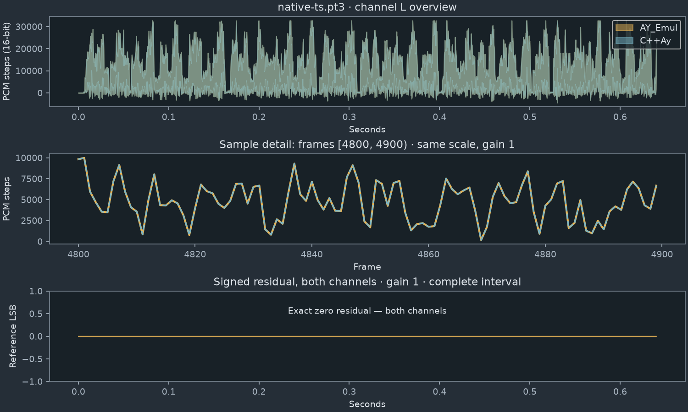

<p align="center"></p>

# C++Ay

A 64-bit desktop player for AY/YM chiptunes, built in C++20 and Qt Quick.
A slate, silver and amber interface brings the character of a late-2000s music
player to native streaming playback, compact playlists and independent channel scopes.


## Play, collect and convert

- **PT3, PT3.7 TurboSound, PSG and YM3/YM3b** with embedded titles and durations.
- Streaming playback, pause/resume, seek, previous/next and whole-song repeat;
  three or six triggered voice scopes and stereo meters.
- Native multi-file chooser (including Ctrl+A), recursive folder import, drag/drop,
  playlist reordering, M3U load/save and batch WAV export.
- Compact mixer: AY/YM model, clock, interrupt timing, stereo gains, preamp,
  sample rate and FIR/averager. Logarithmic playback volume.
- Fresh-from-reset WAV export, independent of playback cursor and volume.
- Atomic playlist/settings/position checkpoints every ten seconds and on exit.
  Reopening without file arguments resumes the saved play/pause state.
- Custom title bar: drag to move, double-click to maximize/restore, edge/corner
  resize, minimize and close. Existing logo and retro controls throughout.

| Format | Implemented support | Independent evidence / limits |
| --- | --- | --- |
| PT3 | Native decoder, source version tables/effects | Original direct-export pair; selected synthetic effects and header/table cases |
| PT3.7 TurboSound | Two chips, six voices | Synthetic PCM and ordered register events |
| PSG | Versions 0–10, file timing and explicit override | Synthetic register/noise/envelope/skip cases; other variants rejected |
| YM | YM3/YM3b | Synthetic PCM/events; YM4–6, digidrums and compressed VTX absent |

Complete AY_Emul application parity is **unfinished**. CPU-backed AY/AYM, SNDH,
other tracker families, structural music finder, subsong UI, AYL/PLS/CUE and tray
integration remain required work in the [coverage record](IMPLEMENTATION.md).
This release does not implement or certify them. Python and Pascal are
verification tools, not playback dependencies.

## Measured audio fidelity

C++Ay compares its native PCM with independently produced AY_Emul audio.
The original supplied direct export passes the fixed complete-interval contract;
additional synthetic source-reference cases support the scope listed above.
There is no fitted gain, offset, resampling or omitted tail.

<!-- fidelity-table:start -->
| Fixture / profile | PCM | Frames (seconds) | Unequal samples | Max error (LSB) | Worst window relative / SNR | Verdict |
| --- | --- | ---: | ---: | ---: | --- | --- |
| Flexo02 | 48000 Hz / 16-bit / 2 ch | 2,457,879 (51.2058125) | 0 | 0 | 0 / ∞ (zero error) | **BIT_EXACT_PCM** |
| native-ts.pt3 | 48000 Hz / 16-bit / 2 ch | 30,723 (0.6400625) | 0 | 0 | 0 / ∞ (zero error) | **BIT_EXACT_PCM** |
| AY-48k | 48000 Hz / 16-bit / 2 ch | 2,457,879 (51.2058125) | 0 | 0 | 0 / ∞ (zero error) | **BIT_EXACT_PCM** |
| YM-averager | 48000 Hz / 16-bit / 2 ch | 2,457,879 (51.2058125) | 0 | 0 | 0 / ∞ (zero error) | **BIT_EXACT_PCM** |
<!-- fidelity-table:end -->

**BIT_EXACT_PCM** means identical intended format/frame count and every decoded
sample equal. **NEAR_MATCH_TARGET_MET** requires relative RMS error ≤ 1e-6
(SNR ≥ 120 dB) and maximum error ≤ one LSB for each channel, whole track and
all required windows. The [fixed criteria and provenance](docs/FIDELITY.md)
explain silence, traces, window coverage and the narrowly qualified WAV-header
quirk. These are engineering thresholds, not a perceptual accuracy percentage.

The profile is source-default YM2149F, 1,773,400 Hz, 50 Hz, ABC stereo,
preamp 127 and 49-tap FIR; the Pascal reference uses AY_Emul **3.0 beta source**.
The original export executable's version and architecture are unknown. Its
profile is inferred from source defaults and qualified against the complete
export, not inferred from its WAV header. Tested source/build identity and UTC
measurement date are in the [generated summary](docs/fidelity/summary.json).
Offline PCM results do not certify an OS mixer, audio device or DAC.



Public synthetic example, **entire 0.6400625-second interval, gain 1**:
[AY_Emul reference WAV](docs/fidelity/listening/native-ts.pt3/reference.wav) ·
[C++Ay WAV](docs/fidelity/listening/native-ts.pt3/candidate.wav) ·
[detailed measurements](docs/fidelity/listening/native-ts.pt3/report.json) ·
[offline A/B report](docs/fidelity/listening/index.html).
The supplied real music is private; only its numerical results/hashes are public.
[All measured rows and profile cases](docs/fidelity/summary.md).

To listen locally with reliable WAV seeking:

```sh
python3 tools/serve_evidence.py --directory docs/fidelity/listening
# Open http://127.0.0.1:8080/index.html
```

## Install or build

**[Download C++Ay 0.1.0](https://github.com/itamarcps/CppAy/releases/tag/v0.1.0).** Linux is the primary target.

| Download | Installation |
| --- | --- |
| [Windows x64 ZIP](https://github.com/itamarcps/CppAy/releases/download/v0.1.0/C%2B%2BAy-0.1.0-windows-x64.zip) | Extract the whole ZIP and run `C++Ay.exe`. |
| [Linux x86-64 archive](https://github.com/itamarcps/CppAy/releases/download/v0.1.0/C%2B%2BAy-0.1.0-linux-x86_64.tar.gz) | Requires the compatible CachyOS/Arch system runtime described below. |
| [Source archive](https://github.com/itamarcps/CppAy/releases/download/v0.1.0/C%2B%2BAy-0.1.0-source.tar.gz) | Build with Qt 6.8+ using the instructions below. |
| [Public audio evidence](https://github.com/itamarcps/CppAy/releases/download/v0.1.0/C%2B%2BAy-0.1.0-public-evidence.tar.gz) | Self-contained reports, lossless A/B audio and measured plots. |
| [SHA-256 checksums](https://github.com/itamarcps/CppAy/releases/download/v0.1.0/SHA256SUMS) | Run `sha256sum -c SHA256SUMS` beside the downloaded archives. |

See the [release notes](docs/RELEASE_NOTES.md) for verified scope and limitations.

The Linux x86-64 `.tar.gz` is a dynamically linked **system-Qt** package.
Extract it and run `bin/C++Ay`; install compatible runtime packages listed in
its `INSTALL.txt` / `PACKAGE.json`. The prepared binary targets the tested
CachyOS/Arch runtime (Qt 6.11.2, matching GCC/glibc), not arbitrary Linux
installations. Building from source is the appropriate route on other systems.

Windows: extract the **whole** `C++Ay-0.1.0-windows-x64.zip` and run
`C++Ay.exe`, keeping DLLs/QML/plugins beside it. Qt/MinGW runtimes and notices
are included. MinGW binaries are verified under Wine; physical Windows 11 x64
hardware remains untested. No macOS qualification is claimed.

Source requirements: a 64-bit C++20 compiler, **CMake 3.24+**, Ninja,
**Qt 6.8+** Core, Quick, QuickControls2, Multimedia, Concurrent, Network and
Widgets, including QML Controls/Layouts and a platform/audio backend.
Locally tested: GCC 16.2.1, Qt 6.11.2. Release uses GCC `-O3 -DNDEBUG`.
Tests/evidence require Python 3, NumPy and Matplotlib.

CachyOS/Arch build dependencies:

```sh
sudo pacman -S --needed base-devel cmake ninja qt6-base qt6-declarative qt6-multimedia python-numpy python-matplotlib
# Optional KDE native file chooser integration:
sudo pacman -S --needed plasma-integration
cmake --preset linux-release
cmake --build --preset linux-release --parallel
ctest --preset linux-release --no-tests=error
./build/C++Ay
```

For other distributions, install their corresponding Qt development packages;
[build details](docs/BUILDING.md) include non-system Qt, core-only builds,
installation and pinned Windows cross-compilation. CI declares Ubuntu 24.04
with an official Qt SDK; see the [actual build results](https://github.com/itamarcps/CppAy/actions/workflows/ci.yml).

## First use

**Add…** opens the native multi-file chooser; **Folder…** recursively imports
modules. Double-click a playlist entry, drag the timeline to seek, and open
**Mixer…** to choose chip/output settings. **Export WAV…** always starts from
reset using that profile. Existing files are never overwritten; batch export
chooses unused suffixed names. **List tools** reorders/loads/clears the playlist
and exports it. Drop module files into the player to add them.

| Shortcut | Action |
| --- | --- |
| L | Add music |
| X | Play |
| C | Pause/resume |
| V | Stop |
| Z / B | Previous / next |
| G | Mixer |
| Delete | Remove selected entry |

Headless examples (PSG/trace options follow the output filename):

```sh
./build/aytool --version
./build/aytool inspect tests/fixtures/native-ts.pt3
./build/aytool render tests/fixtures/native-ts.pt3 /tmp/cppay-example.wav
./build/aytool trace tests/fixtures/native-ts.pt3 /tmp/cppay-events.jsonl
./build/aytool psg tests/fixtures/native-ts.pt3 /tmp/cppay-example.psg
```

Options: `--ay`, `--no-filter`, `--rate N`, `--clock N`, `--interrupt N`,
`--preamp N`, `--max-seconds N`, `--memory-mib N`. Defaults bound full exports
to ten minutes / 256 MiB; live playback uses bounded streaming queues. CLI
outputs refuse overwrites. `inspect` currently performs a full render.

Session storage retains the legacy IDs to preserve existing user settings:
Linux `$XDG_DATA_HOME/AyPlayer/AyPlayer/session.json` (default
`~/.local/share/AyPlayer/AyPlayer/session.json`), settings
`~/.config/AyPlayer/AyPlayer.conf`; Windows Qt standard application data/settings
under `AyPlayer`. File arguments override automatic playback restoration.

If startup reports a missing QML module/platform plugin, install the matching
Qt Quick runtime/style and Wayland/XCB plugin. If playback reports no audio
device or unsupported rate, check your sound server and select a supported
rate in Mixer. `QT_QUICK_BACKEND` can override the default software scene graph;
[measured memory behavior](docs/MEMORY.md) explains that choice.

## Reproduce the measurements

A build/test pass and a fidelity pass are separate gates:

```sh
python3 tools/release_fidelity.py --renderer build/aytool --output build/public-fidelity
# Full required gate: original private pair must be supplied at manifest paths.
python3 tools/release_fidelity.py --renderer build/aytool --output build/required-fidelity --private
```

Use a fresh output directory. Required missing data fails with
`BLOCKED_MISSING_REFERENCE`; ordinary public tests never advertise the private
gate as passed. Output includes manifest/checksums, per-channel/window JSON,
readable table, real plots, WAV/residual audio, offline HTML and an evidence
archive. Private archives must stay local. See [full recipe](docs/FIDELITY.md)
and [tests](docs/TESTING.md) for independent Pascal qualification, sanitizer and
installed-GUI verification. Committed expectations are never generated by C++Ay.

Live playback, GUI export and `aytool` share the production `aycore` renderer:
load module → timed ordered registers → AY/YM chip state → source mixing/filter
and interpolation → stereo PCM. QtAudio sends it to the selected default device;
playback volume is separate from canonical export/comparison PCM.

## Status and credits

The focused release's verified formats are listed above; full original scope
is still open. Linux tests ran on CachyOS/KDE Wayland with an available audio
output. Wine is a compatibility test, not physical Windows validation. Broader
DPI/accessibility, hardware/device and real-world format coverage remain limited.

Report issues with the application version, OS/Qt/audio backend, format/profile,
reproduction steps and logs. Attach music only when you have permission to share
it. [Open an issue](https://github.com/itamarcps/CppAy/issues).
[Release notes and handoff](docs/RELEASE_NOTES.md) ·
[publication instructions](docs/RELEASING.md) · [contributing](CONTRIBUTING.md).

Original project contributions and branding: **MIT**, [LICENSE](LICENSE).
AY_Emul-derived routines/tables retain **Sergey Bulba's original terms and
attribution**; they are not relicensed by MIT. Thanks to Sergey Bulba,
Hacker KAY and the credited tracker/table contributors, including V_Soft.
[Component notices](THIRD_PARTY.md) · [original AY_Emul notice](reference/AY_EMUL_NOTICE.txt).
Qt and distributed runtime components retain their own licenses/notices.
