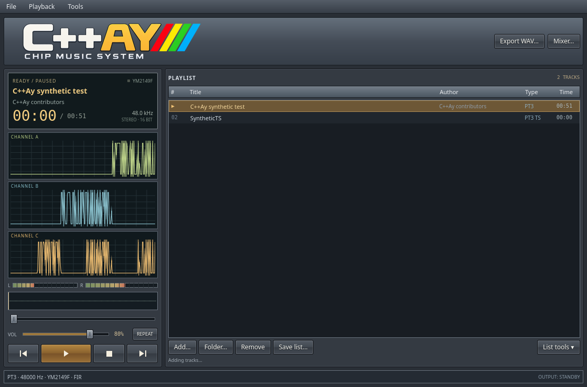

<p align="center"></p>

# C++Ay

A 64-bit C++20 / Qt desktop chiptune player for Linux and Windows, with a
2008–2013 desktop-player look and a native AY/YM audio engine.



## Features

- Native PT3, PT3.7 TurboSound, PSG and YM3/YM3b playback.
- Streaming synthesis, seeking, independent three/six-channel triggered scopes
  and stereo meters.
- Compact playlists with embedded music titles, native multi-file selection,
  recursive folder import and M3U load/save.
- Compact mixer for chip model, clock, timing, channel gains, output and filter.
- WAV export from the start of the song, plus batch playlist export and CLI tools.
- Playback position, playlist and settings saved every ten seconds and on exit;
  launch without file arguments to resume.

The engine ports the relevant AY_Emul routines by Sergey Bulba. Complete
AY_Emul format and feature parity is still in progress; see
[implementation coverage](IMPLEMENTATION.md). Python and Pascal are development
and reference tools, not playback dependencies.

## Build and run on Linux

Requires a **64-bit** C++20 compiler, CMake 3.24+, Ninja and Qt 6.8+ with Quick,
QuickControls2, Multimedia, Concurrent, Network and Widgets. Qt 6.11.2 and GCC
16.2 have been tested locally. Regression checks also need Python 3 and NumPy.

```sh
python3 -m venv .venv
. .venv/bin/activate
python -m pip install -r requirements-dev.txt
cmake --preset linux-release
cmake --build --preset linux-release --parallel
ctest --preset linux-release
./build/C++Ay
```

If Qt is installed outside the system search path, supply
`-DCMAKE_PREFIX_PATH=/path/to/Qt/gcc_64` when configuring.
[Build options and installation](docs/BUILDING.md).

## Windows x64

For a portable build, extract the **entire** `C++Ay-windows-x64.zip` package and
run `C++Ay.exe`. Keep its DLLs, plugins and QML directories beside the executable.
No separate Qt or MinGW installation is needed on the destination machine.

Cross-compile on Linux with:

```sh
./tools/build_windows.sh
```

The script downloads pinned Qt 6.11.2 and matching MinGW GCC 13.1 archives into
`.deps/`, builds the application and creates
`build-windows/C++Ay-windows-x64.zip`. The bootstrap is tested on CachyOS/Arch
x86-64 and needs native Linux Qt 6.11.2 host tools. See
[Windows build requirements](docs/BUILDING.md#windows-cross-compilation).

The Windows binaries have passed PCM, export and UI checks under Wine. Physical
Windows hardware has not yet been tested. Qt 6.11 targets Windows 11 x64.
Build outputs belong in release assets, not Git history.

## Using the player

Use **Add…** for the native file chooser; Ctrl+A selects all files. **Folder…**
imports a folder and its subfolders. Double-click a playlist row to play it.
**List tools** provides reordering, playlist load/save/clear and export actions.

Drag the timeline cursor or position slider to seek. WAV export always renders
from the beginning with the selected mixer profile, independently of playback
position and playback volume. The volume slider uses a logarithmic perceptual
scale, with 0% muted and 100% at unity gain. Existing destinations are never overwritten.

| Key | Action |
| --- | --- |
| L | Add music |
| X | Play |
| C | Pause/resume |
| V | Stop |
| Z / B | Previous / next track |
| G | Mixer |
| Delete | Remove selected playlist entry |

The session is restored when launching without a file argument. A playing song
resumes; a paused song remains paused. Atomic checkpoints protect the last
complete snapshot after a crash; an unexpected shutdown can lose roughly ten
seconds of progress. Explicit file arguments take precedence over automatic
resume. Session storage retains legacy internal Qt IDs for compatibility.

Rendering defaults to Qt Quick's software backend to avoid unnecessary GPU and
video initialization overhead. [Memory investigation](docs/MEMORY.md).

## Command-line tools

```sh
./build/aytool inspect /path/to/song.pt3
./build/aytool render /path/to/song.pt3 /path/to/new-output.wav
./build/aytool trace /path/to/song.pt3 /path/to/new-events.jsonl
./build/aytool psg /path/to/song.pt3 /path/to/new-output.psg
```

Render options include `--ay`, `--no-filter`, `--rate N`, `--clock N`,
`--interrupt N`, `--preamp N`, `--max-seconds N` and `--memory-mib N`.
The default qualified profile is YM2149F, 1,773,400 Hz, 50 Hz interrupts,
preamp 127 and the source's 49-tap FIR. Playback uses bounded streaming buffers;
full WAV exports temporarily hold the rendered PCM.

## Development and licensing

The public tests contain synthetic inputs and immutable expected PCM/events from
an independent AY_Emul source adapter. They need no private music or reference
SDK. [Test details](docs/TESTING.md), [contribution guide](CONTRIBUTING.md),
[release procedure](docs/RELEASING.md).

Original C++Ay contributions and supplied branding are licensed under
[MIT](LICENSE). AY_Emul-derived routines, tables and reference adapters retain
upstream attribution and terms; Qt and bundled runtimes have their own licenses.
See [THIRD_PARTY.md](THIRD_PARTY.md) and
[the original AY_Emul notice](reference/AY_EMUL_NOTICE.txt).
The privately supplied Flexo02 music/WAV pair and reference archives are not
included in the public repository or release packages.
